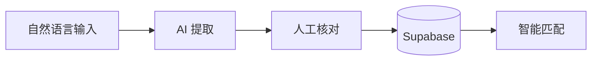

# **校寻 (UniLostFound) - PRD**

### **1. 目标用户**
- **核心群体**：在校大学生、教职工、校园后勤人员。
- **用户画像**：在校园内丢失物品或捡到物品，希望快速、安全地寻找失主或寻回失物的个体。

### **2. 核心痛点**
- **信息分散**：失物招领信息散落在各个微信群、QQ群、表白墙，没有统一的入口。
- **沟通效率低**：失主和拾得者之间难以快速建立联系，信息匹配全靠缘分。
- **隐私风险**：在群里直接发联系方式容易被骚扰，且无法验证真实性。
- **管理困难**：后勤部门积压大量失物，缺乏数字化的管理手段。

### **3. 核心功能 (MVP)**
- **智能发布 (AI 辅助)**：
    - 用户只需上传物品照片或描述，AI 自动提取关键词（物品类别、品牌、颜色、拾得时间/地点）。
    - AI 自动生成标准化的招领/寻物启事。
- **双向匹配提醒**：系统根据关键词自动匹配“失物”与“招领”记录，并实时推送通知。
- **信息看板**：分类展示全校最新的失物和招领信息，支持搜索。
- **用户私聊系统 (New)**：
    - 失主与拾得者可以直接在平台内发起私聊。
    - **数据隔离**：确保聊天内容仅双方可见。
    - **安全隐私**：无需公开微信号或手机号即可沟通。
- **智能发布流水线 (Week 7 Upgrade)**：
    - **节点 1：信息采集**：支持文本输入/图片上传（预留）。
    - **节点 2：AI 智能解析**：调用 DeepSeek 提取关键词。
    - **节点 3：人工审核 (Human-in-the-loop)**：展示解析结果，允许用户修正后再发布。
    - **节点 4：结构化入库**：自动关联用户 UID 并存入 Supabase。
    - **节点 5：自动匹配匹配 (Agentic)**：入库后立即触发全局匹配，发现潜在失主即刻提醒。
- **系统免疫系统 (Week 8 Upgrade)**：
    - **故障自愈 (Reliability)**：针对 API 调用引入“指数退避重试”机制，应对网络抖动。
    - **全链路追踪 (Observability)**：新增前端日志面板，记录每个工作流节点的输入输出。
    - **防御性编程**：增强错误捕获逻辑，确保单一节点失败不会导致页面白屏。
- **身份验证 (Supabase Auth)**：确保发布者身份真实，通过内建私聊方式联系，保护隐私。
- **架构答辩准备 (Week 9 Final)**：
    - **ADR 文档化**：完整记录 4 项核心架构决策及其权衡。
    - **可视化审计**：提供 Mermaid 架构图，清晰展示数据流与工作流。
    - **防御性演示**：通过日志面板展示系统的健壮性与可观测性。

### **4. 核心架构设计**

### **5. 数据模型**
| 字段名 | 类型 | 说明 |
| :--- | :--- | :--- |
| `id` | UUID | 记录唯一标识 |
| `user_id` | UUID | 发布者标识 |
| `type` | String | 'lost' (失物) 或 'found' (招领) |
| `item_name` | String | 物品名称 |
| `category` | String | 物品类别（如：证件、数码、钥匙等） |
| `description` | Text | 详细描述 |
| `image_url` | String | 物品照片链接 |
| `location` | String | 丢失/拾得地点 |
| `occurred_at` | DateTime | 丢失/拾得时间 |
| `status` | String | 'active' (寻找中) 或 'resolved' (已找回) |

### **5. 成功标准**
- **匹配成功率**：通过关键词匹配，月均成功找回率达到 30% 以上。
- **用户活跃度**：校园内 20% 以上的丢失事件能在该平台发布。
- **响应时间**：从发布到获得潜在匹配提示的平均时间在 1 小时内。
