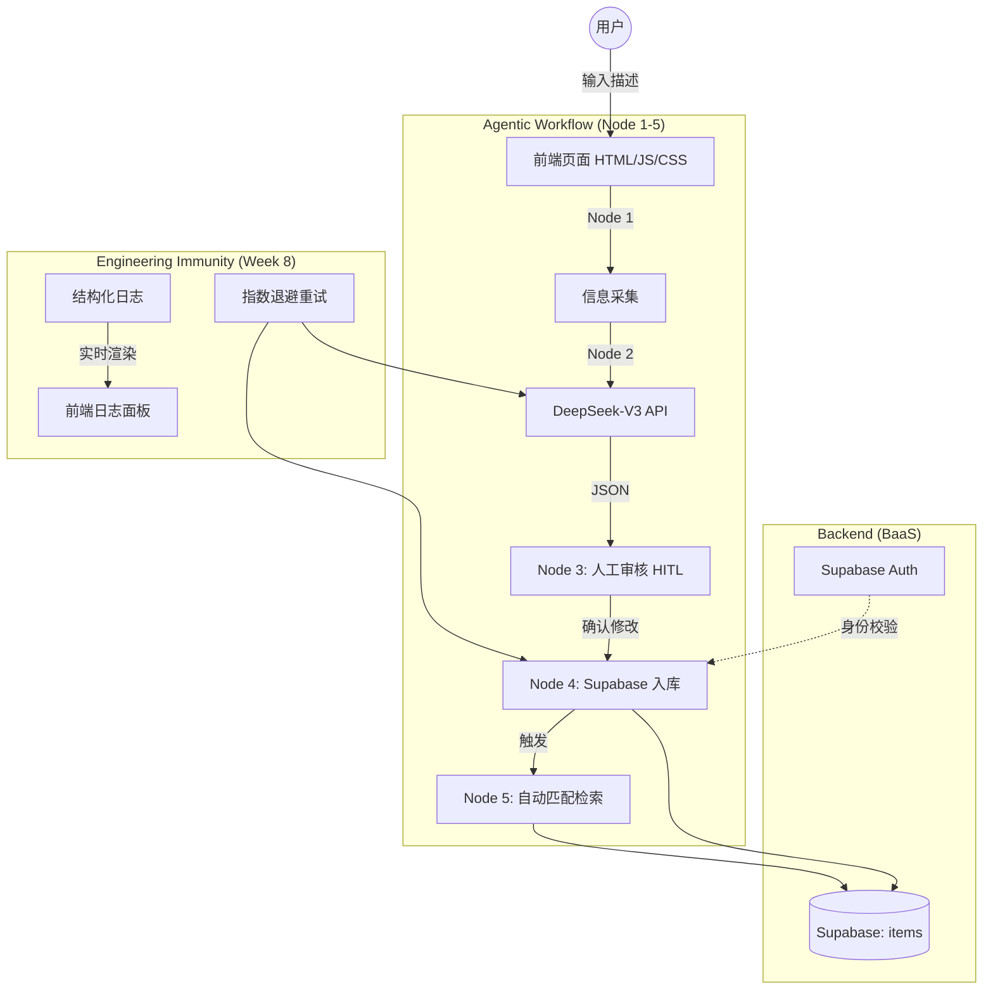

# **校寻 (UniLostFound) 路演指南 (Week 9)**

本指南专为第 9 周“架构答辩”路演设计，包含 5 分钟演讲脚本、架构图及核心问答。

---

## **1. 核心架构图 (Mermaid)**

---

## **2. 5 分钟路演脚本**

### **第 1 分钟：产品演示 (Problem & MVP)**
- **话术**：“大家好，我是 [你的名字]。在校园里丢了东西，我们通常只能发表白墙或加群，信息碎片化且隐私得不到保护。**校寻 (UniLostFound)** 解决了这个问题。它是一个基于 AI 的智慧平台。请看演示：我只需输入‘在二教捡到一个银色 iPad’，AI 会自动提取特征。用户可以在入库前手动修正（HITL），点击发布后，系统会立即检索数据库，告诉我有多少潜在失主。”

### **第 2 分钟：架构决策辩护 (ADR)**
- **话术**：“我们的系统不仅仅是堆砌功能。请看架构图（展示 Mermaid 图）。我们最核心的一条决策是 **ADR 3: 引入 Human-in-the-loop 机制**。为什么不直接全自动入库？因为 AI 存在幻觉，比如它可能会把‘二教’误认为‘图书馆’。通过在入库前增加一个‘人工核对’节点，我们将系统准确率从 AI 的上限提升到了人的准确率，确保了数据库的纯净。”

### **第 3 分钟：工作流与数据流 (Workflow)**
- **话术**：“系统采用了 **Agentic Workflow** 模式。**Node 1 & 4 是代码锁死的轨道**，确保数据格式符合数据库 Schema；而 **Node 2 是智能判断节点**，利用 DeepSeek-V3 的语义理解能力处理模糊的自然语言。这种‘代码定义轨道，LLM 负责节点判断’的设计，让系统既灵活又可靠。”

### **第 4 分钟：质量工程证据 (Evidence)**
- **话术**：“为了让系统在真实环境‘活下去’，我们给它装了免疫系统。请看屏幕底部的 **Observability 日志面板**。它记录了每一个节点的输入输出。同时，针对 API 可能的超时，我们实现了 **指数退避重试 (Exponential Backoff)**。如果 DeepSeek 接口抖动，系统会以 1s、2s、4s 的间隔自动重试，而不是直接报错给用户。”

### **第 5 分钟：最脆弱的点 (Fragile Point)**
- **话术**：“目前系统最脆弱的地方在于 **Node 1 的输入多样性**。虽然预留了图片上传接口，但目前主要依赖文本。如果用户上传的是低质量、模糊的照片，AI 的解析成功率会下降。下一步我们计划引入 **Multimodal 多模态能力**（如 DeepSeek-VLM 或 GPT-4o），先对图片进行预处理描述，再进入解析流，从而提升复杂场景下的鲁棒性。”

---

## **3. 核心 ADR 摘要 (用于回答提问)**

| ADR 编号 | 核心决策 | 代价/权衡 (Trade-off) |
| :--- | :--- | :--- |
| **ADR 1** | Supabase BaaS | **代价**：业务逻辑与特定平台深度绑定，迁移成本高。 |
| **ADR 2** | DeepSeek JSON Mode | **代价**：依赖第三方 API 稳定性，可能存在限流风险。 |
| **ADR 3** | HITL (人工在环) | **代价**：牺牲了“一键式”的极简体验，增加了一步点击。 |
| **ADR 4** | 免疫系统 (Retry/Log) | **代价**：增加了前端代码复杂度（约 60 行额外逻辑）。 |

---

## **4. 检查清单 (路演前 5 分钟)**
- [ ] 确保 `DEEPSEEK_API_KEY` 有效。
- [ ] 确保已登录 Supabase 账号（演示发布功能）。
- [ ] 准备一段包含“幻觉诱导”的测试文本（如不写明地点，看 AI 是否填“待核实”）。
- [ ] 打开控制台和前端日志面板，准备展示重试或数据流过程。
